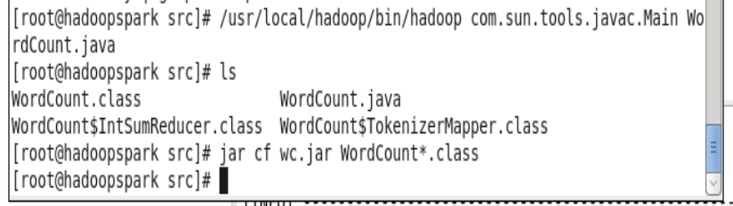
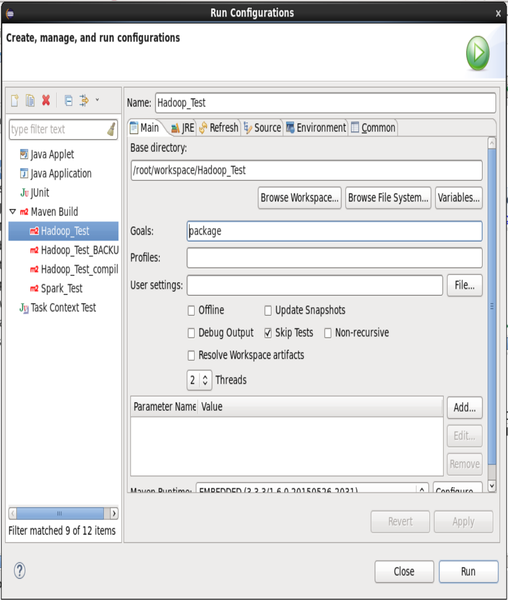

# Práctica 1
## Inicialización:
1. Entrar como root
2. Borrar datos anteriores del HDFS:  
`rm -rf /tmp/hadoop-root/*`
3. Formatear el HDFS (no borra datos):  
`hadoopc hdfs namenode -format`
4. Arrancar el HDFS:
`hadoopc start dfs`
5. Crea el directorio `/test` en el HDFS:  
`hadoopc hdfs dfs -mkdir /test`
6. Sube un fichero:  
`hadoopc hdfs dfs -put /etc/hadoop/hadoop-env.sh /test`
7. Descarga ese fichero:  
`hadoopc hdfs dfs -get /test/hadoop-env.sh /root/hadoop-env-2.sh`
8. Se puede comprobar que son el mismo fichero:  
`diff hadoop-env-2.sh /etc/hadoop/hadoop-env.sh`
9. Arrancamos MapReduce:  
`hadoopc start yarn`

Para comprobar que todo ha ido correctamente, accedemos a las siguientes páginas:
1. [HDFS](http://localhost:50070)
2. [MapReduce](http://localhost:8088)


# Práctica 2
## Se compilará el programa que hay de Hadoop
1. El servicio de MapReduce debe estar iniciado. Si no lo está, ejecutar:  
`hadoopc start yarn`
2. Arrancar eclipse  
`eclipse`
3. Abrir el proyecto *Hadoop\_Test* del workspace por defecto.  

Ahora debería ser tan fácil como `Run as > Maven Build` pero eso no va a ser así.
1. Abrir una terminal como root.
2. Ejecutar las siguientes líneas (sacadas de la [documentación de Apache](https://hadoop.apache.org/docs/r2.6.0/hadoop-mapreduce-client/hadoop-mapreduce-client-core/MapReduceTutorial.html#Usage)):  
```bash
export JAVA_HOME=/usr/java/default
export PATH=$JAVA_HOME/bin:$PATH
export HADOOP_CLASSPATH=$JAVA_HOME/lib/tools.jar
```
3. Nos colocamos en `/root/workspace/Hadoop_Test/src`, donde está el fichero *WordCount.java*.  
4. Ejecutamos el comando:  
```bash
/usr/local/hadoop/bin/hadoop com.sun.tools.javac.Main WordCount.java
jar cf wc.jar WordCount*.class
```



5. Ejecutamos el .jar:  
```bash
hadoopc hadoop jar /root/workspace/Hadoop_Test/src/wc.jar WordCount /test/hadoop-env.sh /test/output
```
Esto lo que hará será ejecutar *WordCount* sobre el fichero hadoop-env.sh que habíamos creado en el HDFS en el [paso de inicialización](#Inicialización) y guardará los resultados en */test/output/* dentro del HDFS.  

6. Podemos obtener el resultado llamando al HDFS:  
```bash
hadoopc hdfs dfs -get /test/output /root/output_hadoop_1
```
*output_hadoop_1* es un directorio que contiene los resultados.

### Nota
Por si acaso, dejo aquí la configuración de ejecución que hay que tener en eclipse para que se pueda compilar. Hay que hacer lo siguiente:  
1. Click dcho. en el proyecto (*Hadoop_Test*).  
2. Run as > Run configurations  
Directorio base: `/root/workspace/Hadoop_Test`  
Goals: `package`
3. Ponemos esto y le damos a *Run*.  

  

De todos modos creo que no hace falta esto, pero porsi.


# Práctica 3
## Enunciado
A partir de un fichero de entrada, devolver otro con una línea donde aparezca la palabra más frecuente y sus apariciones.  
Ejemplo de fichero de entrada:
```
hola 2
que  4
tal  3
```
Fichero de salida correspondiente:
```
que 4
```

## Planteamiento
Partimos de un programa que a partir de un fichero de texto genérico, produce el tipo de fichero de entrada que buscamos (*WordCount.java*). Es decir, que a partir del siguiente fichero:
```
hola hola que que que que tal tal tal
```
*WordCount.java* nos producirá el siguiente fichero de salida:
```
hola 2
que  4
tal  3
```
El primer paso será replicar el comportamiento de *Wordcount.java* en PySpark (con los cuadernos de Jupyter) para asegurarnos de que entendemos cómo se hace. Luego pasaremos a prototipar de la misma forma el programa que buscamos, para finalmente traducirlo a Java.  

Lo primero está en [TODO: introducir enlace al PySpark de WordCount]  
Lo segundo en [TODO: introducir enlace al PySpark de CuentaPalabras]  
Lo último en [TODO: introducir enlace al fichero Java de CuentaPalabras]  
