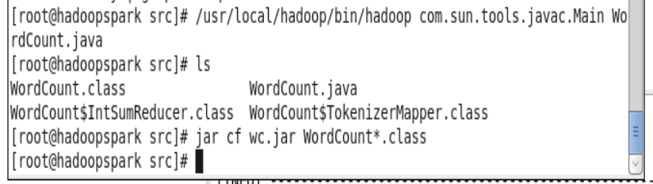
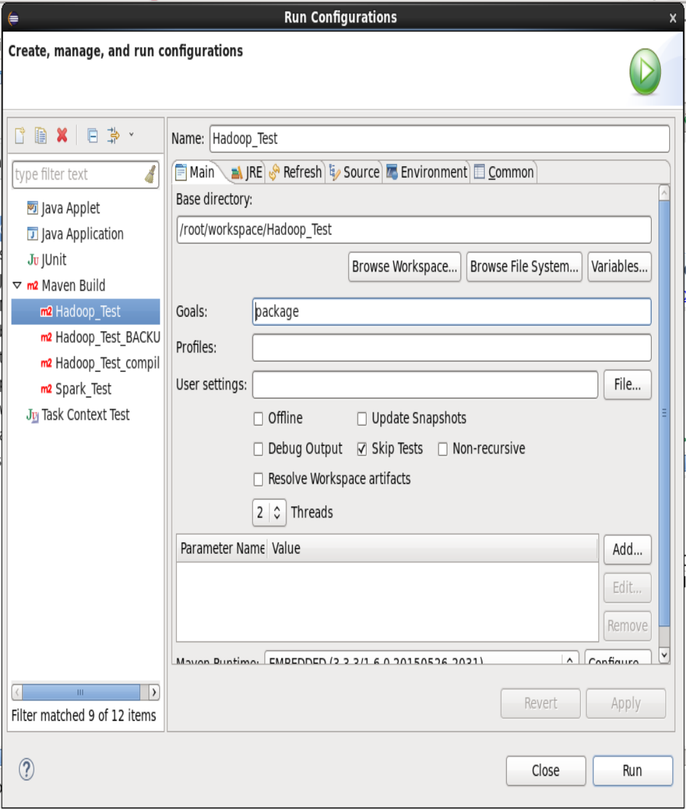

# Ejercicio 2
## Se compilará el programa que hay de Hadoop
1. El servicio de MapReduce debe estar iniciado. Si no lo está, ejecutar:
`hadoopc start yarn`
2. Arrancar eclipse
`eclipse`
3. Abrir el proyecto *Hadoop\_Test* del workspace por defecto.

Ahora debería ser tan fácil como `Run as > Maven Build` pero eso no va a ser así.
1. Abrir una terminal como root.
2. Ejecutar las siguientes líneas (sacadas de la [documentación de Apache](https://hadoop.apache.org/docs/r2.6.0/hadoop-mapreduce-client/hadoop-mapreduce-client-core/MapReduceTutorial.html#Usage)):
```bash
export JAVA_HOME=/usr/java/default
export PATH=$JAVA_HOME/bin:$PATH
export HADOOP_CLASSPATH=$JAVA_HOME/lib/tools.jar
```
3. Nos colocamos en `/root/workspace/Hadoop_Test/src`, donde está el fichero *WordCount.java*.
4. Ejecutamos el comando:
```bash
/usr/local/hadoop/bin/hadoop com.sun.tools.javac.Main WordCount.java
jar cf wc.jar WordCount*.class
```



5. Ejecutamos el .jar:
```bash
hadoopc hadoop jar /root/workspace/Hadoop_Test/src/wc.jar WordCount /test/hadoop-env.sh /test/output
```
Esto lo que hará será ejecutar *WordCount* sobre el fichero hadoop-env.sh que habíamos creado en el HDFS en el [paso de inicialización](#Inicialización) y guardará los resultados en */test/output/* dentro del HDFS.

6. Podemos obtener el resultado llamando al HDFS:
```bash
hadoopc hdfs dfs -get /test/output /root/output_hadoop_1
```
*output_hadoop_1* es un directorio que contiene los resultados.

### Nota
Por si acaso, dejo aquí la configuración de ejecución que hay que tener en eclipse para que se pueda compilar. Hay que hacer lo siguiente:
1. Click dcho. en el proyecto (*Hadoop_Test*).
2. Run as > Run configurations
Directorio base: `/root/workspace/Hadoop_Test`
Goals: `package`
3. Ponemos esto y le damos a *Run*.



De todos modos creo que no hace falta esto, pero porsi.
